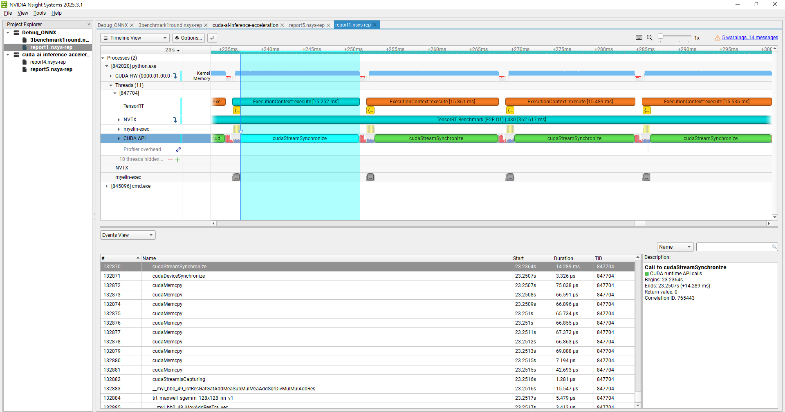

# DistilGPT2-ONNX-TensorRT-Deployment

>  This README focuses on **end-to-end (E2E)** latency. It documents how I used Nsight/logs to locate bottlenecks, implemented a **minimal O1 optimization**, and why under this setup **TensorRT (E2E)** is still slower than **PyTorch (E2E)**.

---

## Project Overview

This project demonstrates exporting Hugging Face **DistilGPT2** to ONNX and running it with **NVIDIA TensorRT** on Windows (GTX 1060), with rigorous performance analysis.

* **Reproducible**: clear env, commands, and settings.
* **E2E metrics**: compare *real* end‑to‑end latency, not kernel-only time.
* **Debug → Verify → Tradeoffs**: Nsight Systems + ONNX verbose logs for evidence; apply targeted optimization (O1) and openly describe limitations.

> **Bottom line:** We measure true end-to-end latency. A minimal O1 (pre-alloc + last-step logits only) cuts E2E by 30–43%, but PyTorch `generate` remains faster **because it uses a KV cache (O(L))** while our TRT path is **O(L²)**. **To close the gap, add a KV cache**


---

## Inference Pipeline Overview

```bash
PyTorch (native inference)
      ↓
Export to ONNX
      ↓
ONNX Runtime (ONNX inference)
      ↓
Build TensorRT Engine
      ↓
TensorRT (inference)
      ↓
Profiling & Debugging (Nsight, Verbose Logs)
```

* **PyTorch**: model dev & baseline.
* **ONNX**: exchange format.
* **ONNX Runtime**: general purpose engine (CPU/GPU).
* **TensorRT**: NVIDIA GPU‑specific; manual memory binding & data movement design.
* **Nsight Systems**: E2E timeline.
* **ONNX Verbose Logs**: op/device placement & inserted Memcpy nodes.

---

## Directory Structure

```
DistilGPT2-ONNX-TensorRT-Deployment/
├── onnx/                  # Exported ONNX models
├── distilgpt2_fp32.engine # TensorRT engine (FP32)
├── benchmark_all.py       # Run all benchmarks & aggregate
├── run_pytorch.py         # PyTorch baseline
├── run_onnx.py            # ONNX Runtime baseline
├── run_tensorrt.py        # TensorRT baseline (early kernel-only measurement)
├── run_tensorrt_O1.py     # TensorRT O1 (E2E: prealloc + D2H last-step only)
├── images/
│   ├── nsight_onnx_memcpy.PNG
│   ├── nsight_pytorch_profile.PNG
│   ├── tensorrt_pipeline_latency.PNG
│   └── tensorrtO1_pipeline_latency.PNG
├── nsight_reports/
│   └── 3benchmark1round.nsys-rep
└── README.md
```

---

## Environment & Version Details

* **OS**: Windows 10 (64‑bit)
* **GPU**: NVIDIA GeForce GTX 1060 3GB (Pascal, CC 6.1)
* **Python**: 3.10
* **PyTorch**: 2.1.0+cu121
* **Transformers**: 4.40.0
* **ONNX**: 1.14.1
* **ONNX Runtime**: 1.14.1 (CUDA)
* **TensorRT**: 8.6.1.6 (FP32 only on Pascal)
* **CUDA**: 12.x

*Check version info in your own environment with:*

```
python --version
python -c "import torch; print(torch.__version__, torch.version.cuda)"
python -c "import transformers; print(transformers.__version__)"
python -c "import onnx; print(onnx.__version__); import onnxruntime; print(onnxruntime.__version__)"
trtexec --version
nvcc --version
nvidia-smi
```

**Note:**

* GTX 1060 (Pascal) is only supported up to TensorRT 8.6.x and CUDA 12.x, and *FP32 only*.
* ONNX Runtime must be installed with CUDA support for GPU acceleration.

---

## Exporting to ONNX

Export the DistilGPT2 PyTorch model to ONNX using Hugging Face Transformers utility:

```bash
python -m transformers.onnx --model=distilgpt2 onnx/model.onnx
```

* This command downloads pretrained distilgpt2, exports to `onnx/model.onnx`.
* This command exports the model with dynamic axes enabled by default (both batch size and sequence length are dynamic), allowing flexible input shapes for deployment with ONNX Runtime or TensorRT.
* If using `torch.onnx.export` directly, be sure to set
  `dynamic_axes={"input_ids": {0: "batch_size", 1: "seq_len"}, "attention_mask": {0: "batch_size", 1: "seq_len"}}`.

---

## Building the TensorRT Engine

With ONNX ready, build the TensorRT engine for optimized inference.

**Command used:**

```bash
trtexec --onnx=onnx/model.onnx --saveEngine=distilgpt2_fp32.engine \
  --minShapes=input_ids:1x1,attention_mask:1x1 \
  --optShapes=input_ids:8x16,attention_mask:8x16 \
  --maxShapes=input_ids:16x32,attention_mask:16x32
```

* **FP32** engine is built (only supported precision for GTX 1060).
* min/opt/max shapes specify the supported dynamic input profile:
  * **Batch size:** 1–16
  * **Sequence length:** 1–32 (fully dynamic; both `input_ids` and `attention_mask` must always have identical shapes)
* The engine accepts inputs **only** within these batch and sequence length ranges; providing a shape outside this profile will trigger runtime errors.

**Tip:**
* For autoregressive decoding, always ensure the dynamic shape profile covers the full prompt + generated tokens length. Without this, TensorRT will crash when the sequence grows beyond the profile limit.
* If you need longer generations, set a larger `--maxShapes` (e.g., `16x64`).

---

## Measurement Methodology & Fairness

**E2E definition**: One-time **H2D** (Host→Device) for the initial prompt → per-step **Compute** → per-step **D2H** (Device→Host) for the needed result; the whole decode loop is timed.

**Why this is not an apples‑to‑apples comparison**:

1. **PyTorch `generate` uses KV cache** (default `use_cache=True`) → per‑step **O(L)**; tensors stay on GPU; **almost no per‑step memcpy**.
2. **ONNX/TensorRT path here does not use KV cache** → per‑step **O(L²)** recompute; more H2D/D2H overall.
3. **Sync points**: TRT/ONNX Python loop calls `cudaDeviceSynchronize()` per step, making overlap harder; PyTorch’s internal loop is tighter.

### Why KV cache ⇒ per-step O(L)

**Context (step t, current length = t):**
- **With KV cache** – past **K/V** are stored on GPU. At step *t* we compute a new **Q_t**, dot it with cached **K[1..t-1]**, then weight cached **V[1..t-1]**.  
  ➜ **Per-step cost ≈ O(t)** (linear).

- **Without KV cache** – rebuild full attention for all *t* tokens every step (`t × t` attention).  
  ➜ **Per-step cost ≈ O(t²)** (quadratic).

**Complexity summary**

| Case              | Per-step cost | Total cost up to length L |
|-------------------|---------------|---------------------------|
| With KV cache     | **O(L)**      | **O(L²)**                 |
| Without KV cache  | **O(L²)**     | **O(L³)**                 |

**KV cache:** lets each new token only attend to history once (linear), instead of rebuilding the whole `t×t` attention every step (quadratic).


### Nsight Systems (overview)

**PyTorch** — decode loop stays mostly on GPU (few transfers).  


**ONNX** — many long `cudaMemcpyAsync` (red) → dominant E2E cost.  


**TensorRT** — green (host waits): including orange (kernels) + red (copies). **E2E includes kernels and copies**.  


### GPU Timeline Color Legend & Latency Definitions

**How to read Nsight timelines:**
- **Orange** = `ExecutionContext::execute` (GPU kernels; device-side compute)
- **Red** = `cudaMemcpy` （Host→Device（H2D）/ Device→Host（D2H） transfers）
- **Green** = host/device sync (e.g., `cudaStreamSynchronize`), i.e., CPU waiting; it overlaps with device work and is **not additional GPU time** to be added again.

**Two common latency definitions:**
1) **Kernel-only** — measure just the GPU compute (e.g., `execute_v2` + a sync). Useful for kernel tuning, but excludes I/O.
2) **End-to-end (E2E)** — includes H2D → compute → D2H and any required synchronization. This best reflects real deployment behavior and is what this README reports as the primary metric.


---

## Debugging Storyline (how I found and fixed the metrics)

1. **Initial observation**: TensorRT looked fast under **kernel-only** timing.
2. **Switch to E2E**: I timed **H2D → compute → D2H** with NVTX ranges. **Nsight** revealed large memcpy bars and host waits that kernel-only had skipped.
3. **ONNX logs → hypothesis**: **ONNX verbose logs** showed CPU fallbacks and inserted Memcpy nodes. That explained ONNX’s E2E lag and suggested a direction: **transfers and per-step allocations are the real pain**. *(No TensorRT verbose was used.)*
4. **Apply the idea on TensorRT (O1)**: After moving to TRT (no CPU fallbacks), Nsight still showed transfers dominating. I implemented **O1**—**pre-allocate** device buffers and **copy back only the last-step logits**—to attack the transfer/alloc overhead directly.
5. **Results & correctness**: E2E dropped by **30–43%** and Nsight showed shorter memcpy bars. Decoded outputs matched PyTorch **token-by-token**. The main remaining gap is the **missing KV cache** (per-step O(L) vs O(L²)).

> Chain of evidence: kernel-only looked great → switch to E2E → ONNX logs expose CPU fallback/Memcpy → hypothesize transfer/alloc bottleneck → TRT O1 fix → measurable E2E win; remaining gap = KV cache.

---


## Benchmark Results (E2E)

### Fixed seq\_len = 12, varying batch

| batch | seq\_len | PyTorch (ms) | ONNX (ms) | TensorRT E2E (ms) | **TensorRT E2E O1 (ms)** |
| ----: | -------: | -----------: | --------: | ----------------: | -----------------------: |
|     1 |       12 |        56.37 |     34.36 |             66.61 |       **57.86** (↓13.1%) |
|     8 |       12 |        58.81 |     82.46 |            105.13 |       **73.24** (↓30.3%) |
|    16 |       12 |        60.45 |    131.51 |            170.67 |      **102.03** (↓40.2%) |

### Fixed batch = 8, varying seq\_len

| batch | seq\_len | PyTorch (ms) | ONNX (ms) | TensorRT E2E (ms) | **TensorRT E2E O1 (ms)** |
| ----: | -------: | -----------: | --------: | ----------------: | -----------------------: |
|     8 |        8 |        31.57 |     31.27 |             50.02 |       **34.22** (↓31.6%) |
|     8 |       16 |        88.35 |    131.67 |            170.80 |      **110.50** (↓35.3%) |
|     8 |       32 |       205.31 |    474.65 |            628.14 |      **355.64** (↓43.4%) |

## Accuracy Verification

To validate functional correctness, I compared decoded outputs from the TensorRT path against the original PyTorch model across multiple prompts, batches, and sequence lengths. For all tested settings, the decoded sequences **matched exactly** token-by-token. This confirms the TensorRT deployment preserves model behavior relative to the PyTorch baseline.


**Interpretation**

* **O1** (minimal changes) delivers **30–43%** E2E reduction:

  * Change A: **Pre‑allocate & reuse device buffers** (remove per‑step malloc/free).
  * Change B: **D2H only the last step `[B, vocab_size]` logits** (do not transfer the full `[B, cur_len, vocab_size]`).
* Still, without **KV cache**, TRT recomputes the whole sequence each step and I/O remains on the critical path → **still slower than PyTorch E2E**.

> Earlier I also measured **kernel‑only** (just `execute_v2` + a sync) and saw very small numbers. Nsight showed that is **not E2E**: real deployments include H2D/D2H. This README reports **E2E** to avoid confusion.

### Sanity check: Kernel‑only vs E2E (TensorRT)

| batch, seq | TRT kernel‑only (ms) | TRT E2E (ms) | TRT E2E O1 (ms) | E2E / Kernel‑only (×) | O1 drop |
| ---------- | -------------------: | -----------: | --------------: | --------------------: | ------: |
| b=1,  L=12 |                 7.08 |        66.61 |           57.86 |                 9.41× |   13.1% |
| b=8,  L=12 |                 8.41 |       105.13 |           73.24 |                12.50× |   30.3% |
| b=16, L=12 |                15.65 |       170.67 |          102.03 |                10.91× |   40.2% |
| b=8,  L=8  |                 8.85 |        50.02 |           34.22 |                 5.65× |   31.6% |
| b=8,  L=16 |                 9.07 |       170.80 |          110.50 |                18.83× |   35.3% |
| b=8,  L=32 |                16.53 |       628.14 |          355.64 |                38.00× |   43.4% |

> **Read**: kernel‑only reflects GPU kernel time only. **E2E includes H2D/D2H and sync**, hence **5.6–38×** larger than kernel‑only. O1 (pre‑alloc + last‑step logits only) reduces E2E by **30–43%**, but without KV cache the O(L²) recompute and I/O still dominate.

---

## Why TensorRT (E2E) < PyTorch (E2E) here

1. **Different algorithmic path**: PyTorch `generate` uses **KV cache** (O(L)) with an internal GPU loop; the ONNX/TRT path here has **no cache** (O(L²)).
2. **I/O and sync**: TRT/ONNX perform per‑step H2D/D2H and use sync APIs; PyTorch has near‑zero per‑step I/O.
3. **Hardware**: GTX 1060 (Pascal, FP32‑only) has weaker copy/compute overlap; the gap is amplified under this design.


---

## Profiling & Debugging Analysis (evidence)

### GPU timeline: how to read it (quick legend)

* **Orange** = `ExecutionContext::execute` (GPU kernels; device-side compute)
* **Red** = `cudaMemcpy` (H2D/D2H transfers)
* **Green** = host/device sync (e.g., `cudaStreamSynchronize`); CPU waiting and overlapping with device work — **do not add it as extra GPU time**.
* **E2E latency** = kernels **+** copies **+** necessary sync; this is the primary metric reported in this README.

### Nsight Systems (overview)

* **ONNX**: many long `cudaMemcpyAsync` (red) → dominant E2E cost.
  `images/nsight_onnx_memcpy.PNG`
* **PyTorch**: decode loop stays mostly on GPU (few transfers).
  `images/nsight_pytorch_profile.PNG`
* **TensorRT**: orange (kernels) + red (copies) + green (host waits). **E2E includes kernels and copies**.
  `images/tensorrt_pipeline_latency.PNG`

### ONNX verbose logs (confirm memcpy & fallback)

Representative lines that match what Nsight shows:

```
[W:onnxruntime:, transformer_memcpy.cc:83 ...] 6 Memcpy nodes are added to the graph main_graph for CUDAExecutionProvider. It might have negative impact on performance...
Add Memcpy From Host after <node_name> for CUDAExecutionProvider
Add Memcpy To Host before <node_name> for CUDAExecutionProvider
I: ExecutionFrame ... Using CPUExecutionProvider for <op_name>  (fallback)
```

### Nsight evidence: O1 reduces memcpy & API overhead

> Same settings: `batch=8, seq_len=32, repeat=1`. Same timeline zoom. NVTX ranges aligned.

**Baseline (TensorRT E2E)**


*Caption—Baseline:* in-loop `cudaMalloc/cudaFree` are present; red `cudaMemcpy` bars are long and dense because D2H pulls near the full `[B, cur_len, vocab_size]`. Copies dominate the NVTX window.

**O1 (pre-alloc + D2H last step only)**


*Caption—O1:* pre-allocation removes per-step `cudaMalloc/cudaFree`; D2H shrinks to just the last-step logits `[B, vocab_size]`. Red `cudaMemcpy` bars are visibly shorter and less frequent; E2E drops by **30–43%** in our tables.

### Where to find the raw artifacts

* Screenshots: [`images/`](images/)
* Nsight Systems report(s): [`nsight_reports/`](nsight_reports/)
* Repro scripts: `run_*` and `benchmark_all.py`


---

## Handling Autoregressive Inference

DistilGPT2 decodes tokens step by step.

* **Attention mask & inputs**: append the new token each step; mask must reflect valid positions.
* **Performance**: sequence grows over time. Without KV cache, each step recomputes the whole sequence.
* **Validation**: compare generated sequences between TensorRT and PyTorch step‑by‑step.

**Sample Autoregressive Loop (Key Logic)**

```python
# Assume device = torch.device("cuda" if torch.cuda.is_available() else "cpu")
generated_ids = tokenizer.encode("TensorRT is", return_tensors="pt").to(device)
attention_mask = torch.ones_like(generated_ids).to(device)

for _ in range(max_new_tokens):
    inputs = {"input_ids": generated_ids, "attention_mask": attention_mask}
    logits = tensorrt_model(**inputs).logits  # Or PyTorch/ONNX model
    next_token_id = logits[:, -1, :].argmax(dim=-1, keepdim=True)
    generated_ids = torch.cat([generated_ids, next_token_id], dim=-1)
    attention_mask = torch.cat([attention_mask, torch.ones_like(next_token_id)], dim=-1)

output_texts = tokenizer.batch_decode(generated_ids, skip_special_tokens=True)
```

---

## Memory Binding for TensorRT Inference (Pseudo-code Walkthrough)

Efficient inference with TensorRT requires manual memory management for all model inputs and outputs. Unlike higher-level frameworks, TensorRT expects you to allocate GPU memory, manage host-device transfers, set input/output shapes, and bind memory for every inference call.

This section summarizes the **complete memory binding workflow** as annotated pseudo-code, so any engineer can quickly see the core technical steps without digging through long scripts.

---

### Manual Memory Binding: Step-by-Step (Pseudo-code)

```python
# (1) Prepare input data (tokenize & pad to numpy, int32)
input_ids, attention_mask = ...  # [batch, seq], np.int32

# (2) Allocate GPU memory for all inputs/outputs
input_ids_ptr = cudaMalloc(input_ids.nbytes)
attention_mask_ptr = cudaMalloc(attention_mask.nbytes)
output_ptr = cudaMalloc(output_size)

# (3) Copy input data from host (CPU) to device (GPU)
cudaMemcpy(input_ids_ptr, input_ids, cudaMemcpyHostToDevice)
cudaMemcpy(attention_mask_ptr, attention_mask, cudaMemcpyHostToDevice)

# (4) Set dynamic binding shapes for each input (if needed)
context.set_binding_shape(0, input_ids.shape)         # input_ids
context.set_binding_shape(1, attention_mask.shape)    # attention_mask

# (5) Prepare list of all device pointers (bindings)
bindings = [input_ids_ptr, attention_mask_ptr, output_ptr]

# (6) Execute inference (synchronously)
context.execute_v2(bindings)
cudaDeviceSynchronize()

# (7) Copy output data from device back to host
cudaMemcpy(output, output_ptr, cudaMemcpyDeviceToHost)

# (8) Free all device memory (avoid memory leaks)
cudaFree(input_ids_ptr)
cudaFree(attention_mask_ptr)
cudaFree(output_ptr)
```

---

### Key Notes & Best Practices

* **Match all types and shapes**: Input and output arrays must exactly match the engine’s expected shapes and dtypes, or inference will fail.
* **Always free device memory**: Never leave device pointers unfreed—avoid memory leaks, especially in long-running processes or autoregressive loops.
* **Profile shapes in advance**: Dynamic shape support means you must set binding shapes before each inference if batch/seq lengths change.
* **Pre-allocate for efficiency**: For real-time or batch workloads, consider reusing pre-allocated GPU buffers instead of allocating/freeing every step.
* **Reference**: Full working example in `run_tensorrt.py`.


---

## Known Pitfalls & Troubleshooting

The following issues were encountered during this project, with concise explanations and recommended solutions:

### 🔸 **Prefer end‑to‑end (E2E) over kernel‑only**

**Why:** Kernel‑only timing omits host↔device transfers Host→Device (H2D) / Device→Host (D2H) and synchronization. In real deployments these costs can be as large—or larger—than the kernel time, so kernel‑only numbers often paint an overly optimistic picture.

**What to report:** Use **E2E latency** as the primary metric: **H2D → compute → D2H + any required sync** across the entire decode loop.

**If you keep kernel‑only:** Put it in an appendix (or a separate file) and label it clearly as "kernel‑only (no transfers, no sync)" to prevent misinterpretation.


### 🔸 **Engine Profile Not Covering Autoregressive Sequence Lengths**

- **This is the most common and severe pitfall when deploying autoregressive Transformers with TensorRT.**
- If the TensorRT engine is built with a fixed sequence length (e.g., only `seq_len=12`), **autoregressive decoding**—where the sequence length grows with each generated token—will immediately trigger shape mismatch errors or even `CUDA Error 700 (illegal memory access)` at runtime.
- Example error:
    ```
    Error Code 3: API Usage Error ... Supplied binding dimension [16,5] ... but profile is 12
    Error Code 1: Cuda Runtime (an illegal memory access was encountered)
    ```

- **Solution:**  
Always build the engine with `--minShapes` and `--maxShapes` covering the *entire* range of sequence lengths needed for incremental generation (e.g., `--minShapes=input_ids:1x1 --maxShapes=input_ids:16x32`).  
This ensures all dynamic input shapes used during autoregressive inference are supported by the engine profile.  
*If you forget this, TensorRT will not be able to run incremental generation at all.*


### 🔸 **Unsupported Ops during ONNX Export**

When attempting to export DistilGPT2 using the standard Python `torch.onnx.export` API, I encountered failures due to unsupported operators.

**How I discovered the issue:**

* The export process either crashed or produced ONNX models that failed to run in ONNX Runtime, with error messages indicating missing operator implementations.

**Root cause:**

* Certain operations in DistilGPT2 do not have direct equivalents in standard ONNX, or require special graph optimizations that the default export process cannot handle.

**Resolution:**

* The Hugging Face `transformers.onnx` CLI utility (`python -m transformers.onnx ...`) is specifically optimized for their models.
* Using this tool, ONNX export completed successfully and the generated model could be executed in ONNX Runtime and TensorRT.

**Lesson:**

> When exporting transformer models, always prefer the official `transformers.onnx` export command. If a direct Python export fails, try the CLI utility—these often include custom handling and optimizations for complex transformer operations.

### 🔸 **Autoregressive Model Deployment Issues**

- Autoregressive models like DistilGPT2 require careful handling of incremental inference.
- Solution: Ensure the attention mask and input tensors correctly reflect the autoregressive nature. Provide full-length inputs and masks explicitly, and avoid unnecessary recomputations.

### 🔸 **trtexec Command Not Found on Windows**

- TensorRT’s CLI tool (`trtexec.exe`) not found in default Windows PATH.
- Solution: Add TensorRT’s `bin/` directory (typically: `C:\TensorRT-8.6.x.x\bin`) to Windows PATH or run directly from that folder.

### 🔸 **TensorRT Engine Profile Constraints & Shape Errors**

- Inputs must fall within the specified min-max range used to build the TensorRT engine.
- Solution:
  - Set appropriate `minShapes`, `optShapes`, and `maxShapes` when building the engine.
  - If encountering "profileMinDims <= dimensions.d[i]" errors at runtime, rebuild engine with an expanded shape profile or adjust input shape accordingly.

### 🔸 **Mismatch between `input_ids` and `attention_mask`**

- `input_ids` and `attention_mask` dimensions or data types must exactly match, or TensorRT runtime errors occur.
- Solution: Always ensure both inputs have identical shapes (batch & sequence length) and consistent data types (typically `int32`).

### 🔸 **CUDA Version and Compatibility Issues**

- GTX 1060 (Pascal GPU) supports only up to TensorRT 8.6.x and CUDA 12.x with FP32 precision.
- Solution: Carefully verify GPU compatibility before installation, as newer CUDA/TensorRT versions might not support older GPUs.

### 🔸 **Missing cuDNN or CUDA Dependencies**

- TensorRT execution requires appropriate CUDA/cuDNN libraries; missing libraries cause initialization failures.
- Solution: Install TensorRT bundled with compatible CUDA Toolkit and cuDNN versions. Verify installations via:
```bash
nvcc --version
nvidia-smi
```

---

## What Would Close the Gap 

**Enable a KV cache.** During autoregressive decoding, store past Keys/Values on GPU so each new token only attends to history once (**per-step O(L)**) instead of rebuilding full `t×t` attention (**O(L²)**).

How to implement (pick one):
- **ORT/TRT path with past_key_values**: export `past_key_values` in ONNX and keep a device-resident cache between steps.
- **TensorRT-LLM**: use its built-in KV cache support (plus fused kernels). **If hardware permits**, this is the most straightforward route on newer GPUs.

This one change aligns the algorithmic path with PyTorch `generate` and is the main lever to reach parity on E2E latency.


---

### Key Takeaways
- We report **end-to-end (E2E)** latency, not kernel-only.
- **O1** (pre-alloc + last-step logits only) reduces E2E by **30–43%**.
- PyTorch `generate` is still faster **due to the KV cache (per-step O(L))**; our ORT/TRT path is **O(L²)** without it. **Next step: enable a KV cache** (or move to TensorRT-LLM).


---

## Conclusion

This project is about *how* I:

1. Corrected the metric to **E2E**;
2. Used **Nsight/logs** to find the real bottleneck;
3. Applied a **minimal, effective O1** for **30–43%** E2E reduction;
4. Objectively explained **why TensorRT loses to PyTorch under this path**, and outlined the right next steps.

