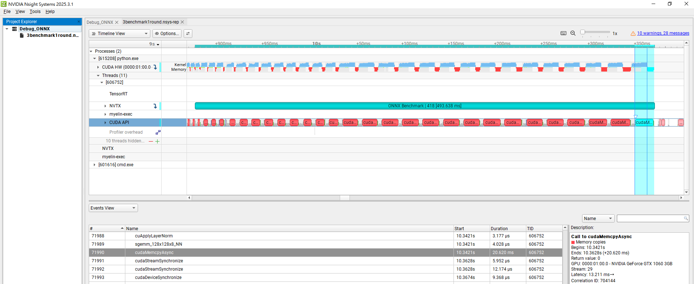
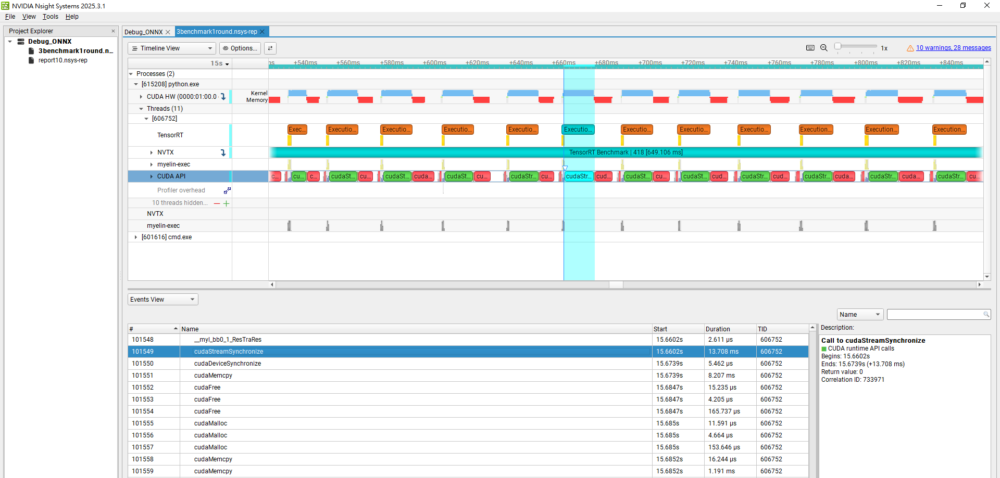
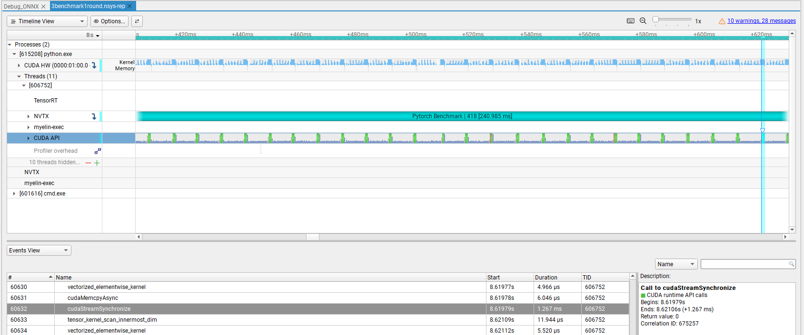

# DistilGPT2-ONNX-TensorRT-Deployment

## Project Overview

> 🚀 This project demonstrates end-to-end Transformer model acceleration on Windows (GTX 1060), with full profiling, debugging, and root cause analysis for ONNX/TensorRT.

DistilGPT2-ONNX-TensorRT-Deployment demonstrates how to accelerate Transformer model inference by exporting a Hugging Face DistilGPT2 model to ONNX and running it with NVIDIA TensorRT. The primary goal is to achieve significantly lower latency compared to standard PyTorch execution, critical for deploying NLP models in real-time applications.

This project focuses on **reproducibility**, clear documentation of every step, fair benchmarking across frameworks (PyTorch vs. ONNX Runtime vs. TensorRT), and practical deployment tips for Windows users. By leveraging TensorRT optimizations, the project achieves dramatic speed-ups for transformer inference while maintaining model output correctness.

### Inference Pipeline Overview

```bash
PyTorch (native inference)  
      ↓  
Export to ONNX  
      ↓
ONNX Runtime (ONNX model inference)  
      ↓  
Convert to TensorRT Engine  
      ↓  
TensorRT (ultra-fast inference)
      ↓
Profiling & Debugging (Nsight, Verbose Logs)
```
* **PyTorch**: Model development and baseline inference.
* **ONNX**: Intermediate exchange format for cross-framework deployment.
* **ONNX Runtime**: General-purpose inference backend (supports CPU/GPU).
* **TensorRT**: NVIDIA GPU-specific, extreme low latency and high throughput.
* **Nsight Systems**: End-to-end GPU profiling and timeline analysis for all inference backends (PyTorch, ONNX, TensorRT).
* **ONNX Runtime Verbose Logs**: Operator/device placement trace and debugging; identify CPU fallback, memory copy bottlenecks, and other execution issues.

---

## Directory Structure

```
DistilGPT2-ONNX-TensorRT-Deployment/
├── onnx/                  # Contains exported ONNX models (e.g. model.onnx)
├── distilgpt2_fp32.engine # TensorRT engine file generated from ONNX
├── benchmark_all.py       # Script to run all benchmarks & collect performance
├── run_pytorch.py         # PyTorch inference script (baseline)
├── run_onnx.py            # ONNX Runtime inference script
├── run_tensorrt.py        # TensorRT inference script (Python API)
├── images/
│   ├── nsight_onnx_memcpy.PNG          # Nsight ONNX memory copy profile
│   ├── nsight_pytorch_profile.PNG      # Nsight PyTorch profile
│   └── tensorrt_pipeline_latency.PNG   # TensorRT pipeline latency
├── nsight_reports/
│   └── 3benchmark1round.nsys-rep       # Nsight profiling report
├── README.md                # Documentation
```

* **onnx/**: Holds the exported ONNX model.
* **distilgpt2\_fp32.engine**: TensorRT engine file, built with FP32 precision (see commands below).
* **Python scripts**: Run individual or all benchmarks; aggregate results.

---

## Environment & Version Details

All benchmarks and deployment steps were performed on the following environment:

* **OS**: Windows 10 (64-bit)
* **GPU**: NVIDIA GeForce GTX 1060 3GB (Pascal, Compute Capability 6.1)
* **Python**: 3.10
* **PyTorch**: 2.1.0+cu121
* **Transformers**: 4.40.0
* **ONNX**: 1.14.1
* **ONNX Runtime**: 1.14.1 (with CUDA GPU support)
* **TensorRT**: 8.6.1.6 (latest for Pascal, FP32 only)
* **CUDA**: 12.0
* **cuDNN**: 8.x (included with CUDA 12.x)
* **trtexec.exe**: TensorRT v8.6.1 (CLI for engine building and benchmarking)

*Check version info in your own environment with:*

```
python --version
python -c "import torch; print(torch.__version__, torch.version.cuda)"
python -c "import transformers; print(transformers.__version__)"
python -c "import onnx; print(onnx.__version__); import onnxruntime; print(onnxruntime.__version__)"
trtexec --version
nvcc --version
nvidia-smi
```

**Note:**

* GTX 1060 (Pascal) is only supported up to TensorRT 8.6.x and CUDA 12.x, and *FP32 only*.
* ONNX Runtime must be installed with CUDA support for GPU acceleration.

---

## Exporting to ONNX

Export the DistilGPT2 PyTorch model to ONNX using Hugging Face Transformers utility:

```bash
python -m transformers.onnx --model=distilgpt2 onnx/model.onnx
```

* This command downloads pretrained distilgpt2, exports to `onnx/model.onnx`.
* This command exports the model with dynamic axes enabled by default (both batch size and sequence length are dynamic), allowing flexible input shapes for deployment with ONNX Runtime or TensorRT.
* If using `torch.onnx.export` directly, be sure to set
  `dynamic_axes={"input_ids": {0: "batch_size", 1: "seq_len"}, "attention_mask": {0: "batch_size", 1: "seq_len"}}`.

---

## Building the TensorRT Engine

With ONNX ready, build the TensorRT engine for optimized inference.

**Command used:**

```bash
trtexec --onnx=onnx/model.onnx --saveEngine=distilgpt2_fp32.engine \
  --minShapes=input_ids:1x1,attention_mask:1x1 \
  --optShapes=input_ids:8x16,attention_mask:8x16 \
  --maxShapes=input_ids:16x32,attention_mask:16x32
```

* **FP32** engine is built (only supported precision for GTX 1060).
* min/opt/max shapes specify the supported dynamic input profile:
  * **Batch size:** 1–16
  * **Sequence length:** 1–32 (fully dynamic; both `input_ids` and `attention_mask` must always have identical shapes)
* The engine accepts inputs **only** within these batch and sequence length ranges; providing a shape outside this profile will trigger runtime errors.

**Tip:**
* For autoregressive decoding, always feed the full prompt + already generated tokens as `input_ids` and `attention_mask`, up to the max sequence length set here.
* If you need longer generations, set a larger `--maxShapes` (e.g., `16x64`).

---

## Benchmark Results

We benchmarked DistilGPT2 inference latency across PyTorch, ONNX Runtime, and TensorRT under various settings.

**Table 1: Latency (ms) for fixed sequence length = 12 tokens, various batch sizes**

| batch | seq\_len | PyTorch (ms) | ONNX (ms) | TensorRT (ms) |
| ----- | -------- | ------------ | --------- | ------------- |
| 1     | 12       | 56.37        | 34.36     | 7.08          |
| 8     | 12       | 58.81        | 82.46     | 8.41          |
| 16    | 12       | 60.45        | 131.51    | 15.65         |

**Table 2: Latency (ms) for fixed batch size = 8, various sequence lengths**

| batch | seq\_len | PyTorch (ms) | ONNX (ms) | TensorRT (ms) |
| ----- | -------- | ------------ | --------- | ------------- |
| 8     | 8        | 31.57        | 31.27     | 8.85          |
| 8     | 16       | 88.35        | 131.67    | 9.07          |
| 8     | 32       | 205.31       | 474.65    | 16.53         |


**Key Observations:**

- **TensorRT achieves the lowest latency across all settings.**  
  For example, at batch=8, seq_len=12, TensorRT is about 8.41 ms, while PyTorch is 58.81 ms and ONNX Runtime is 82.46 ms—TensorRT is up to 7× faster than PyTorch and nearly 10× faster than ONNX Runtime. 
  Even at larger batch sizes and sequence lengths, TensorRT consistently provides substantial acceleration.

- **PyTorch latency remains relatively stable with increasing batch size.**  
  PyTorch's backend is highly optimized for batched GPU workloads, so the per-batch overhead is minimized as batch size increases.

- **ONNX Runtime latency increases rapidly as batch size and sequence length grow.**  
  For smaller inputs, ONNX Runtime may sometimes match or even beat PyTorch, but for large batch or long sequence, ONNX Runtime becomes noticeably slower than both PyTorch and TensorRT. 
  **Possible reasons include:**  
  - ONNX Runtime may invoke sub-graph operators or unsupported ops on CPU, resulting in data transfers between CPU and GPU (especially if the CUDAExecutionProvider is not set as the default).  
  - Some graph optimizations available in PyTorch or TensorRT are either not enabled or not as advanced in ONNX Runtime, leading to less efficient GPU kernel usage.
  - ONNX Runtime may perform additional memory copies or have less optimized kernel fusion for transformer architectures.

- **TensorRT scales efficiently for both batch size and sequence length.**  
  Even as sequence length grows from 8 to 32, TensorRT's latency increases only modestly (from ~9 ms to 16 ms), while PyTorch and ONNX Runtime latency grows much faster.


**Accuracy Verification:**

To ensure that TensorRT deployment preserves model correctness, I **explicitly compared the decoded outputs** from TensorRT and the original PyTorch model. For all tested prompts and settings, the decoded sequences matched exactly, confirming that TensorRT inference is **functionally equivalent** to the original model.


---

## Profiling & Debugging Analysis

This section documents the **real profiling, debugging, and root cause workflow** used in this project, showing how I tracked down ONNX Runtime performance bottlenecks and validated optimizations using Nsight Systems and verbose logs.

---

### 1. Initial Observation: ONNX Runtime is *Unexpectedly Slow*

* After running the benchmark, ONNX Runtime was **much slower** than both PyTorch and TensorRT, especially at larger batch or sequence lengths.
* **Question:** Why is ONNX Runtime so much slower, even with CUDAExecutionProvider enabled?

### 2. Visual Profiling with Nsight Systems

* Used Nsight Systems to capture a GPU timeline for a single inference run (`repeat=1`, with NVTX range annotation).
* **Observation:**

  * The ONNX timeline shows **long, repeated `cudaMemcpyAsync`** (red bars), causing overall pipeline latency to be much longer than expected.
  * By contrast, TensorRT and PyTorch timelines showed mostly uniform kernel executions with minimal memory copy events.
* 

### 3. Deep Dive: ONNX Verbose Logging

* Ran ONNX inference with **verbose logging** (`log_severity_level=0`), saved logs to file, and searched for `Memcpy` or `CPUExecutionProvider`.
* **Key log messages:**

  ```
  [W:onnxruntime:, transformer_memcpy.cc:83 ...] 6 Memcpy nodes are added to the graph main_graph for CUDAExecutionProvider. It might have negative impact on performance...
  Add Memcpy From Host after ... for CUDAExecutionProvider
  ```

### 4. Root Cause: Operator Placement & Memory Transfers

* The **timeline and logs together confirm**:

  * Some ops or outputs are still on CPU, requiring repeated host-device memory copies.
  * This creates `cudaMemcpyAsync` bottlenecks, as seen in the timeline.
* These memory transfers **dramatically increase latency**, even if most computation is on GPU.

### 5. Comparison: TensorRT and PyTorch Baselines

* The same profiling workflow for TensorRT and PyTorch:

  * Both showed efficient GPU usage and minimal transfer overhead.
* 
* 

### 6. Lessons & Optimization Tips

* **Always validate operator/device placement**: Ensure all operators are supported on the desired device, or use model fusion or graph surgery to avoid CPU fallback.
* **Use visual profiling and verbose logs**: They quickly expose root causes for latency.
* **Document with evidence**: Annotated screenshots (timeline, logs) make your story convincing.

---

### Example Key Findings (for README summary)

* ONNX Runtime can have much higher latency if ops fallback to CPU, which triggers excessive host-device memory copies (red `cudaMemcpyAsync` blocks).
* Verbose logs are essential to confirm device placement and diagnose execution bottlenecks.
* TensorRT and PyTorch, when properly configured, achieve higher GPU utilization and lower, more predictable latency.

---

### Where to Find Reports and Images

* Key timeline screenshots: [`images/`](images/)
* Nsight Systems reports: [`nsight_reports/`](nsight_reports/)
* You can reproduce or review the analysis by opening these resources.

---

**Takeaway**:
This project shows not just the *what* (performance numbers), but also the *how* (profiling, root cause analysis, debug evidence). This workflow is a blueprint for troubleshooting and optimizing any AI inference pipeline on GPU.

---


## Handling Autoregressive Inference

DistilGPT2 and similar transformer models often perform autoregressive inference, generating text tokens sequentially based on previous outputs. During this deployment, special care was required to handle incremental inference correctly:

- **Correct Attention Mask & Input Preparation**:  
  Each generated token must be appended to previously generated tokens, forming incremental inputs. The attention mask should accurately reflect valid positions to avoid recomputing previous outputs.

- **Performance Implications**:  
  Autoregressive inference involves repeated model calls with incrementally growing sequences. TensorRT significantly accelerates each inference step, leading to notable cumulative latency reductions compared to PyTorch and ONNX Runtime.

- **Validation Strategy**:  
  Accuracy was verified at each step by comparing intermediate model outputs from TensorRT against the PyTorch baseline, ensuring incremental inference correctness was maintained.

**Sample Autoregressive Loop (Key Logic):**

> **Note:**  
> The following code demonstrates the *logical flow* of autoregressive inference.  
> For the actual TensorRT engine implementation and API usage,  
> please refer to [`run_tensorrt.py`](./run_tensorrt.py) in this repository.

```python
# Assume device = torch.device("cuda" if torch.cuda.is_available() else "cpu")
generated_ids = tokenizer.encode("TensorRT is", return_tensors="pt").to(device)
attention_mask = torch.ones_like(generated_ids).to(device)

for _ in range(max_new_tokens):
    inputs = {"input_ids": generated_ids, "attention_mask": attention_mask}
    logits = tensorrt_model(**inputs).logits  # Or PyTorch/ONNX model
    next_token_id = logits[:, -1, :].argmax(dim=-1, keepdim=True)
    generated_ids = torch.cat([generated_ids, next_token_id], dim=-1)
    attention_mask = torch.cat([attention_mask, torch.ones_like(next_token_id)], dim=-1)

# To decode output ids:
output_texts = tokenizer.batch_decode(generated_ids, skip_special_tokens=True)
print(output_texts)
```
**Tip:**
Always test and validate incremental autoregressive logic thoroughly, ensuring the output tokens match expected sequences when migrating from PyTorch to TensorRT deployment.

---
## Memory Binding for TensorRT Inference (Pseudo-code Walkthrough)

Efficient inference with TensorRT requires manual memory management for all model inputs and outputs. Unlike higher-level frameworks, TensorRT expects you to allocate GPU memory, manage host-device transfers, set input/output shapes, and bind memory for every inference call.

This section summarizes the **complete memory binding workflow** as annotated pseudo-code, so any engineer can quickly see the core technical steps without digging through long scripts.

---

### Manual Memory Binding: Step-by-Step (Pseudo-code)

```python
# (1) Prepare input data (tokenize & pad to numpy, int32)
input_ids, attention_mask = ...  # [batch, seq], np.int32

# (2) Allocate GPU memory for all inputs/outputs
input_ids_ptr = cudaMalloc(input_ids.nbytes)
attention_mask_ptr = cudaMalloc(attention_mask.nbytes)
output_ptr = cudaMalloc(output_size)

# (3) Copy input data from host (CPU) to device (GPU)
cudaMemcpy(input_ids_ptr, input_ids, cudaMemcpyHostToDevice)
cudaMemcpy(attention_mask_ptr, attention_mask, cudaMemcpyHostToDevice)

# (4) Set dynamic binding shapes for each input (if needed)
context.set_binding_shape(0, input_ids.shape)         # input_ids
context.set_binding_shape(1, attention_mask.shape)    # attention_mask

# (5) Prepare list of all device pointers (bindings)
bindings = [input_ids_ptr, attention_mask_ptr, output_ptr]

# (6) Execute inference (synchronously)
context.execute_v2(bindings)
cudaDeviceSynchronize()

# (7) Copy output data from device back to host
cudaMemcpy(output, output_ptr, cudaMemcpyDeviceToHost)

# (8) Free all device memory (avoid memory leaks)
cudaFree(input_ids_ptr)
cudaFree(attention_mask_ptr)
cudaFree(output_ptr)
```

---

### Key Notes & Best Practices

* **Match all types and shapes**: Input and output arrays must exactly match the engine’s expected shapes and dtypes, or inference will fail.
* **Always free device memory**: Never leave device pointers unfreed—avoid memory leaks, especially in long-running processes or autoregressive loops.
* **Profile shapes in advance**: Dynamic shape support means you must set binding shapes before each inference if batch/seq lengths change.
* **Pre-allocate for efficiency**: For real-time or batch workloads, consider reusing pre-allocated GPU buffers instead of allocating/freeing every step.
* **Reference**: Full working example in `run_tensorrt.py`.

---
## Known Pitfalls & Troubleshooting

The following issues were encountered during this project, with concise explanations and recommended solutions:

### 🔸 **Engine Profile Not Covering Autoregressive Sequence Lengths**

- **This is the most common and severe pitfall when deploying autoregressive Transformers with TensorRT.**
- If the TensorRT engine is built with a fixed sequence length (e.g., only `seq_len=12`), **autoregressive decoding**—where the sequence length grows with each generated token—will immediately trigger shape mismatch errors or even `CUDA Error 700 (illegal memory access)` at runtime.
- Example error:
    ```
    Error Code 3: API Usage Error ... Supplied binding dimension [16,5] ... but profile is 12
    Error Code 1: Cuda Runtime (an illegal memory access was encountered)
    ```

- **Solution:**  
Always build the engine with `--minShapes` and `--maxShapes` covering the *entire* range of sequence lengths needed for incremental generation (e.g., `--minShapes=input_ids:1x1 --maxShapes=input_ids:16x32`).  
This ensures all dynamic input shapes used during autoregressive inference are supported by the engine profile.  
*If you forget this, TensorRT will not be able to run incremental generation at all.*


### 🔸 Unsupported Ops during ONNX Export

When attempting to export DistilGPT2 using the standard Python `torch.onnx.export` API, I encountered failures due to unsupported operators.

**How I discovered the issue:**

* The export process either crashed or produced ONNX models that failed to run in ONNX Runtime, with error messages indicating missing operator implementations.

**Root cause:**

* Certain operations in DistilGPT2 do not have direct equivalents in standard ONNX, or require special graph optimizations that the default export process cannot handle.

**Resolution:**

* The Hugging Face `transformers.onnx` CLI utility (`python -m transformers.onnx ...`) is specifically optimized for their models.
* Using this tool, ONNX export completed successfully and the generated model could be executed in ONNX Runtime and TensorRT.

**Lesson:**

> When exporting transformer models, always prefer the official `transformers.onnx` export command. If a direct Python export fails, try the CLI utility—these often include custom handling and optimizations for complex transformer operations.

### 🔸 **Autoregressive Model Deployment Issues**

- Autoregressive models like DistilGPT2 require careful handling of incremental inference.
- Solution: Ensure the attention mask and input tensors correctly reflect the autoregressive nature. Provide full-length inputs and masks explicitly, and avoid unnecessary recomputations.

### 🔸 **trtexec Command Not Found on Windows**

- TensorRT’s CLI tool (`trtexec.exe`) not found in default Windows PATH.
- Solution: Add TensorRT’s `bin/` directory (typically: `C:\TensorRT-8.6.x.x\bin`) to Windows PATH or run directly from that folder.

### 🔸 **TensorRT Engine Profile Constraints & Shape Errors**

- Inputs must fall within the specified min-max range used to build the TensorRT engine.
- Solution:
  - Set appropriate `minShapes`, `optShapes`, and `maxShapes` when building the engine.
  - If encountering "profileMinDims <= dimensions.d[i]" errors at runtime, rebuild engine with an expanded shape profile or adjust input shape accordingly.

### 🔸 **Mismatch between `input_ids` and `attention_mask`**

- `input_ids` and `attention_mask` dimensions or data types must exactly match, or TensorRT runtime errors occur.
- Solution: Always ensure both inputs have identical shapes (batch & sequence length) and consistent data types (typically `int32`).

### 🔸 **CUDA Version and Compatibility Issues**

- GTX 1060 (Pascal GPU) supports only up to TensorRT 8.6.x and CUDA 12.x with FP32 precision.
- Solution: Carefully verify GPU compatibility before installation, as newer CUDA/TensorRT versions might not support older GPUs.

### 🔸 **Missing cuDNN or CUDA Dependencies**

- TensorRT execution requires appropriate CUDA/cuDNN libraries; missing libraries cause initialization failures.
- Solution: Install TensorRT bundled with compatible CUDA Toolkit and cuDNN versions. Verify installations via:
```bash
nvcc --version
nvidia-smi
```

---

## Conclusion

Deploying DistilGPT2 with ONNX + TensorRT on Windows with a GTX 1060 dramatically accelerates inference and is **fully reproducible**. We successfully exported the model, built a TensorRT engine, and resolved all major pitfalls (Windows, shape profiles, batch/seq\_len issues).

TensorRT inference achieves order-of-magnitude speedups compared to both PyTorch and ONNX Runtime, enabling real-time deployment for NLP applications on consumer GPUs. The approach, scripts, and lessons here are generalizable to other Transformer models, and the troubleshooting notes serve as a practical guide for practitioners facing similar deployment challenges.

> **Takeaway for interviewers:**
> This project shows how to take a research model, optimize it for real-world deployment, and systematically address every engineering bottleneck. You can expect the same mindset and thoroughness in my future work.
